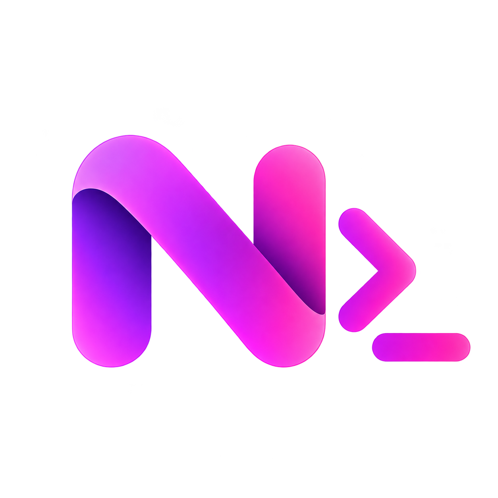
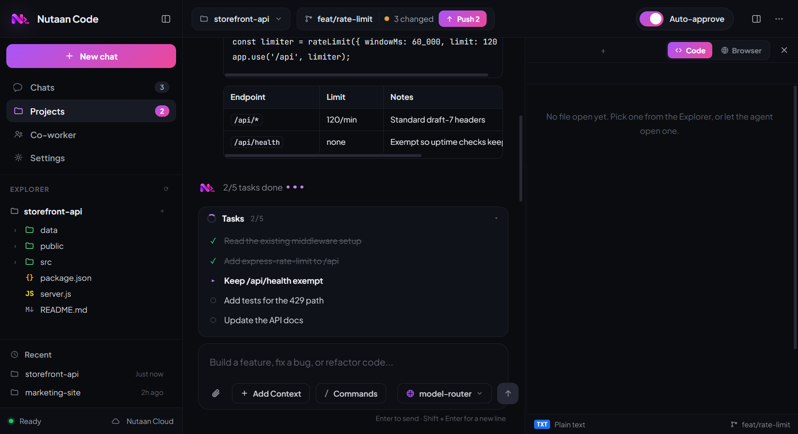
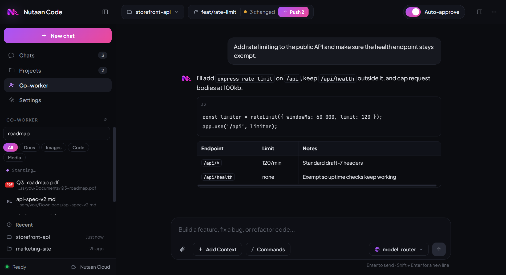
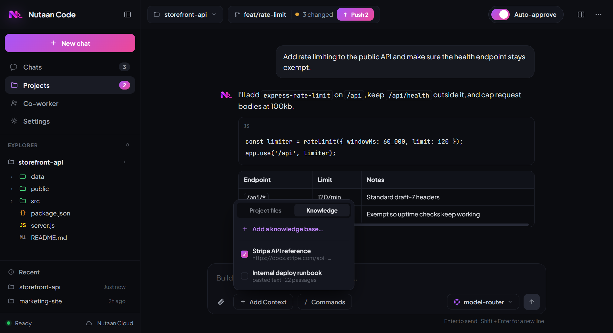
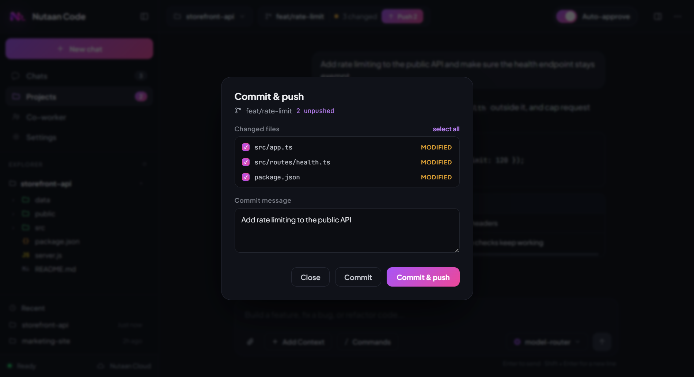

<div align="center">



# Nutaan Code

**An AI coding agent that understands your whole project — and the rest of your computer.**

Windows · macOS · Linux

</div>

---



## What it does

Nutaan Code is a desktop app that reads your codebase, writes and edits files, runs commands,
drives a built-in browser, and keeps a checklist of what it's doing so you can follow along.

- **Works on your real project** — reads, searches, edits and runs, all scoped to the folder you open.
- **Checks its own work** — opens the page in the built-in browser and looks at it, rather than telling you to go and check.
- **Remembers** — a knowledge base you fill with docs and notes, plus memory that carries between chats.
- **Co-worker mode** — finds and opens files anywhere on your machine, not just in the project.
- **One key** — models are reached through nutaan.com with your own API key. No provider keys to manage.

---

## Install

### Download a build

Grab the latest from **[Releases](https://github.com/Tecosys/Nutaan-Code/releases)**.

| Platform | File | Notes |
| --- | --- | --- |
| **Windows** | `Nutaan-Code-Setup-*.exe` | SmartScreen may warn — *More info → Run anyway* |
| **macOS (Apple Silicon)** | `*-arm64.dmg` | First launch: **right-click → Open** |
| **macOS (Intel)** | `*-x64.dmg` | Same |
| **Linux (any)** | `*.AppImage` | `chmod +x` then run |
| **Debian / Ubuntu** | `*.deb` | `sudo dpkg -i nutaan-code_*.deb` |
| **Fedora / RHEL** | `*.rpm` | `sudo rpm -i nutaan-code-*.rpm` |

The macOS and Windows builds are **unsigned**, so the first launch shows a security prompt.
On macOS you must right-click the app and choose *Open* — double-clicking will refuse.

### Run from source

Works the same on all three platforms:

```bash
git clone https://github.com/Tecosys/Nutaan-Code.git
cd Nutaan-Code
npm install
npm start
```

`npm start` prints a banner and opens the app:

```
  ███╗   ██╗
  ████╗  ██║    Nutaan Code  v0.1.17
  ██╔██╗ ██║    AI coding agent · darwin
  ██║╚██╗██║
  ██║ ╚████║    Starting the desktop app…
  ╚═╝  ╚═══╝
```

Ctrl+C in the terminal closes the app. `npm start -- --help` lists the options.

> **Requires Node.js 20+.** Don't install with `--production`: Electron is a devDependency, so
> the app won't have anything to launch.

---

## Getting your API key

Nutaan Code needs one credential: a **nutaan.com API key**. Models are reached through
nutaan.com, so there's no OpenAI, Anthropic or Google key to set up.

1. **Sign in** at **[https://nutaan.com](https://nutaan.com)** — create an account if you don't have one.
2. Go to **[https://nutaan.com/dev-console](https://nutaan.com/dev-console)** — it's **Developers** in the dashboard sidebar.
3. Under **API keys**, click **Create key**, give it a name like `Nutaan Code`, and **copy it**.
4. Paste it into Nutaan Code when it asks.

The key starts with `nut-`. It's stored only on your machine and is sent nowhere except
nutaan.com. You can revoke it any time from the same page, and change it later in
*Settings → nutaan.com account → Change key*.

> Copy the key when it's shown — for security it isn't displayed in full again afterwards.

## First run

Once activated, **Open a project** and start typing. Turn on **Auto-approve** if you'd rather
the agent edit files and run commands without asking each time.

---

## The interface

### Chat and tasks

For anything with more than a few steps, the agent writes a checklist first and keeps it updated
as it works — so you can see what it intends to do and what's left, not just the final answer.

The status line under the composer shows elapsed time, tokens generated, and how many tools are
running in parallel. Independent reads — files, searches, web lookups — run at the same time
rather than one after another.

### Co-worker



Search your whole home folder by name, filter by type, and open a result straight into the
editor. Non-text files open in whatever app your system normally uses. The agent has the same
tools, so you can also just ask: *"organise my Downloads by file type"* or *"find the invoice
from last March and summarise it"*.

### Knowledge base



Point it at a docs page or paste in your own notes. It's chunked, embedded once, and recalled by
meaning in every future chat — so you don't re-explain your stack each time. Attach or detach
sources per conversation from **Add Context → Knowledge**.

Text is embedded through nutaan.com; **the vectors stay on your machine.**

### Commit and push



Click the branch chip to review changed files, write a message, and commit — or commit and push
in one step. A branch with no upstream gets one set automatically.

---

## Models

The picker lists only models confirmed to support tool calling. A lot of the catalog doesn't, and
a model that can't call a tool can't drive an agent — it just looks like the app is broken.

If a model is rate-limited, overloaded, or stalls, the app switches to the next one and carries
on. A model that just failed goes into a short cooldown so the fallback doesn't land straight
back on it.

**Vision works on every model.** If the one you've picked can't see images, a vision-capable
model describes the screenshot and the agent gets that description back.

---

## Building installers

```bash
npm run dist          # your current platform
npm run dist:mac      # macOS  (.dmg, .zip)
npm run dist:linux    # Linux  (.AppImage, .deb, .rpm)
npm run dist:all      # all three
```

Each installer has to be built on its own OS — macOS tooling is required for `.dmg`, Linux
tooling for `.deb`/`.rpm`. CI does all three in parallel: push a `v*.*.*` tag to publish a
release, or use **Run workflow** on the Actions tab to build without publishing.

---

## Troubleshooting

**"Not connected" on startup** — the API key was not accepted. Create a fresh one at
https://nutaan.com/dev-console and re-enter it under *Settings →
nutaan.com account → Change key*.

**macOS says the app is damaged or from an unidentified developer** — it's unsigned. Right-click
the app → *Open* → *Open*. Only needed once.

**A model keeps failing** — the app switches automatically, but you can pick another from the
composer. Models near the top of the list are the fastest and most reliable in testing.

**Running from source does nothing** — check `node --version` is 20 or higher, and that you ran
`npm install` without `--production`.

---

## Privacy

Your code stays on your machine. Files are only read when the agent needs them for the task, and
they're sent to whichever model you've selected, through nutaan.com. Knowledge base vectors,
memory and chat history are stored locally:

| | |
| --- | --- |
| Windows | `%APPDATA%\Nutaan Code` |
| macOS | `~/Library/Application Support/Nutaan Code` |
| Linux | `~/.config/Nutaan Code` |

Knowledge base and memory live in `~/.nutaan/`.
