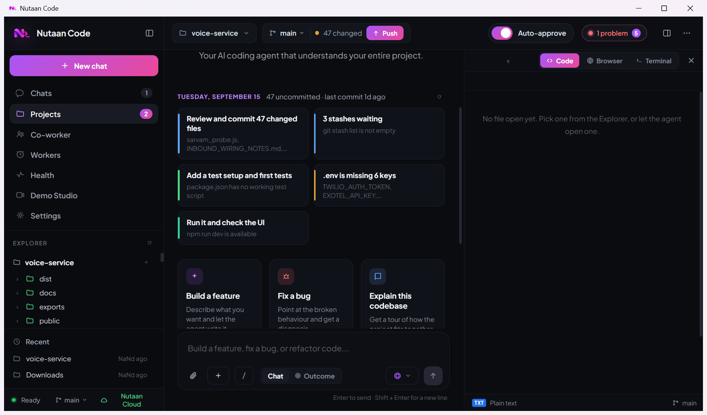
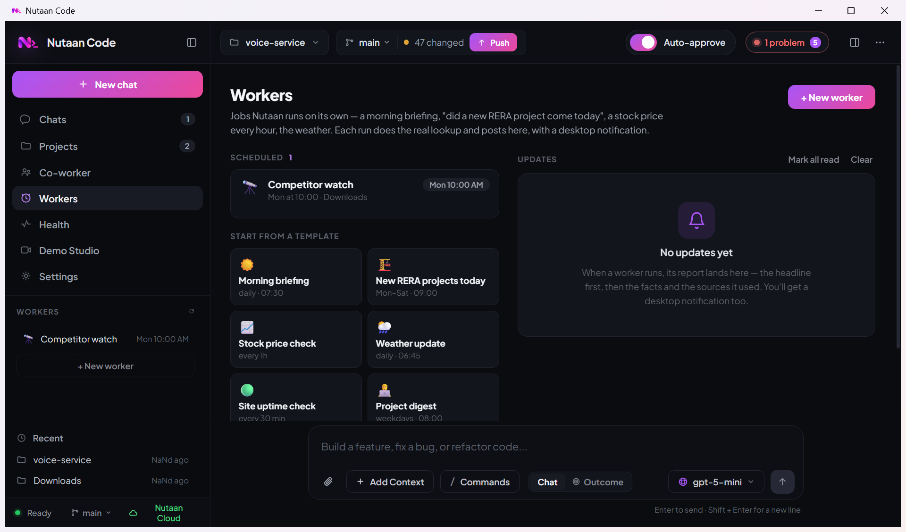
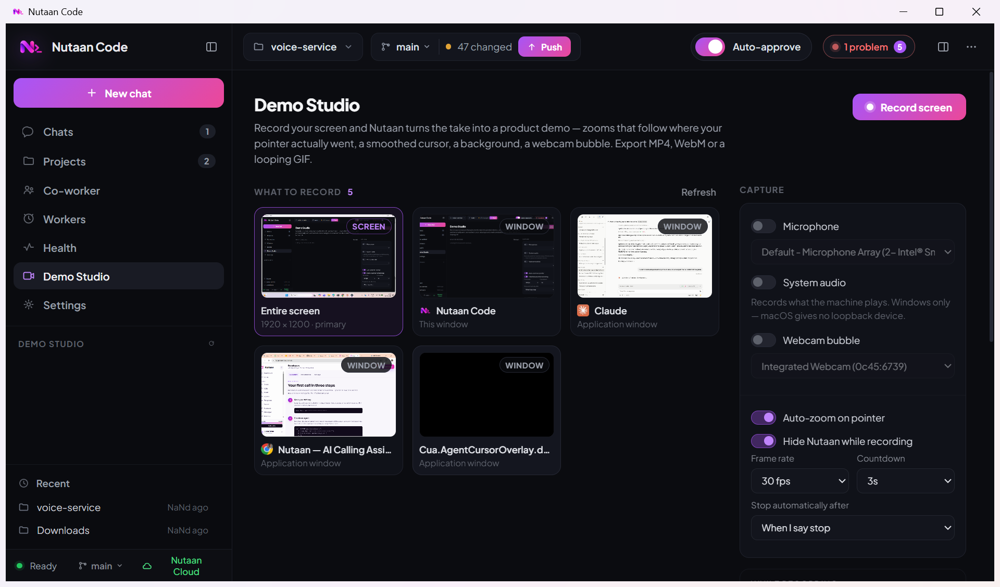

<div align="center">


# Nutaan Code

**An AI coding agent that understands your whole project — and the rest of your computer.**

Windows · macOS · Linux

</div>

---



## What it does

Nutaan Code is a desktop AI coding agent that reads your codebase, writes and edits files, runs
commands, drives a built-in browser, and keeps a checklist of what it's doing so you can follow
along. Beyond coding it runs jobs on a schedule, plans a whole outcome across a team of agents,
heals a broken workspace on its own, connects to Canva/Gmail/Docs and other MCP tools, and reaches
out to the rest of your machine — one app, your own API key.

- **Works on your real project** — reads, searches, edits and runs, all scoped to the folder you open.
- **Checks its own work** — opens the page in the built-in browser and looks at it, rather than telling you to go and check.
- **Remembers** — a knowledge base you fill with docs and notes, plus memory that carries between chats.
- **Co-worker mode** — finds and opens files anywhere on your machine, not just in the project.
- **Autonomous** — scheduled Workers, an Outcome Swarm, and a Self-Healing workspace that fixes crashes as they happen.
- **Connected** — Canva, Codex, Claude Code, Gmail, Outlook, Google Docs/Sheets, NotebookLM and any MCP server.
- **One key** — models are reached through nutaan.com with your own API key. No provider keys to manage.

---

## Features

### 🏠 Smart landing — Today


Open a project and the landing screen shows what it actually needs right now — worked out from the
repo itself, not a canned list: uncommitted files, commits to push, TODO/FIXME comments with their
locations, a missing test setup, a stale lockfile, `.env` keys that `.env.example` declares, open
incidents from the workspace monitor, and the unfinished checklist from your last chat. Every card
shows the evidence it came from. Click one and the instruction lands in the composer.

### 🤖 Chat & tasks


For anything with more than a few steps, the agent writes a checklist first and keeps it updated as
it works — so you can see what it intends to do and what's left, not just the final answer. The
status line shows elapsed time, tokens, and how many tools are running in parallel; independent
reads run at the same time rather than one after another.

### 👥 Co-worker — the machine outside the project


Search your whole home folder by name, filter by type, and open a result straight into the editor.
Non-text files open in whatever app your system normally uses. The agent has the same tools, so you
can also just ask: *"organise my Downloads by file type"* or *"find the invoice from last March and
summarise it"*. It reads Word, Excel, PowerPoint and PDF, and your email straight from `.eml`/`.mbox`
files or webmail in the browser.

### ⚙️ Workers — jobs that run on their own



Set one up from **Workers**, pick a template, or just say it in chat — *"every morning at 8, check
whether any new RERA project was registered"* — and the agent creates it. Each run is a real agent
turn with the web, the browser panel and the OS tools; the result lands in the **Updates** feed with
a desktop notification. Daily, every N minutes, once, on project open, or on app start. Templates:
morning briefing, new RERA projects, stock prices, weather, site uptime, project digest, competitor
watch.

### ◎ Outcome mode & the Nutaan Swarm

Flip the composer to **Outcome** and name the result instead of the steps — *Launch my SaaS*, *Fix
production*, *Research competitors*, *Plan a trip*. A Planner splits the goal across a team —
Developer, Browser QA, Researcher, Reviewer, DevOps — that runs in parallel waves, shares findings
on a board, and merges one report. Each agent shows its live step trail, and each only holds the
tools its job needs. An outcome-sized ask from normal chat is handed to the swarm automatically.

### 🩺 Self-Healing workspace — Health

Nutaan watches the dev server and background tasks for crash and compile errors, the browser panel
for console errors and failed loads, an optional health URL, and (optionally) re-runs your tests
when files change. Anything it sees becomes an incident. In *Watch* mode it tells you; in
*Auto-heal* it hands the incident to a repair agent that walks **Detect → Reproduce → Diagnose →
Patch → Test → Deploy → Verify**, shows each stage live, and only marks *Verify* done with evidence.

### 🔌 Tools & integrations

Connect the apps and services you already use, and their tools become the agent's tools:

| Tool | What the agent can do |
| --- | --- |
| **Canva** (MCP) | Make a document, carousel or presentation natively — real content and images on every page, exported to PDF/PNG |
| **Nutaan AI** (MCP) | Voice agents, phone calls, leads and knowledge bases on your Nutaan account |
| **Claude Code / Codex** | Hand a coding task to another agent and get its answer back |
| **Antigravity** | Open the project, a folder or a file in the Antigravity editor |
| **Gmail / Outlook / Google Docs / Sheets / NotebookLM** | Read, search and draft in your own signed-in window |
| **Any MCP server** | Add a hosted URL or a local command; its tools appear in chat |

Connected agents (Codex, Claude Code) also step in as a fallback when every model is busy.

### 🗺️ Trip planning with real maps

Say *"plan a trip from Mumbai to Puri to Gangasagar"* and it draws the real driving route on a map
(free OpenStreetMap + OSRM — no key), with the true distance and time per leg, then researches the
trains, cabs, hotels and food to cost the whole itinerary. Design results — a Canva link, a route,
a downloadable file — render as proper cards in the thread, not raw links.

### 🎬 Demo Studio



Record your screen and Nutaan turns the take into a product demo — zooms that follow where your
pointer actually went, a smoothed cursor, a background, a webcam bubble. Export MP4, WebM or a
looping GIF.

### 🛡️ Security & OSINT arsenal

A 753-tool OSINT/security catalogue the agent can search, plus native tools that act rather than
lecture: live HTTP/cookie security audits, DNS and subdomain recon, IP intelligence, a zero-GPU
static vulnerability scanner (SQLi, command injection, hardcoded secrets, path traversal), and
security-review skills. For authorised testing only — see [SECURITY.md](SECURITY.md).

### 🌿 Commit, push & branch switch


Click the branch chip to switch branches, or review changed files, write a message, and commit — or
commit and push in one step. A branch with no upstream gets one set automatically.

### 📚 Knowledge base


Point it at a docs page or paste your own notes. It's chunked, embedded once, and recalled by
meaning in every future chat — so you don't re-explain your stack each time. Text is embedded
through nutaan.com; **the vectors stay on your machine.**

---

## Install

### Download a build

Grab the latest from **[Releases](https://github.com/Tecosys/Nutaan-Code/releases)**.

| Platform | File | Notes |
| --- | --- | --- |
| **Windows** | `Nutaan-Code-Setup-*.exe` | SmartScreen may warn — *More info → Run anyway* |
| **macOS (Apple Silicon)** | `*-arm64.dmg` | First launch: **right-click → Open** |
| **macOS (Intel)** | `*-x64.dmg` | Same |
| **Linux (any)** | `*.AppImage` | `chmod +x` then run |
| **Debian / Ubuntu** | `*.deb` | `sudo dpkg -i nutaan-code_*.deb` |
| **Fedora / RHEL** | `*.rpm` | `sudo rpm -i nutaan-code-*.rpm` |

The macOS and Windows builds are **unsigned**, so the first launch shows a security prompt.
On macOS you must right-click the app and choose *Open* — double-clicking will refuse.

### Run from source

Works the same on all three platforms:

```bash
git clone https://github.com/Tecosys/Nutaan-Code.git
cd Nutaan-Code
npm install
npm start
```

`npm start` prints a banner and opens the app:

```
  ███╗   ██╗
  ████╗  ██║    Nutaan Code  v0.1.17
  ██╔██╗ ██║    AI coding agent · darwin
  ██║╚██╗██║
  ██║ ╚████║    Starting the desktop app…
  ╚═╝  ╚═══╝
```

Ctrl+C in the terminal closes the app. `npm start -- --help` lists the options.

> **Requires Node.js 20+.** Don't install with `--production`: Electron is a devDependency, so
> the app won't have anything to launch.

---

## Getting your API key

Nutaan Code needs one credential: a **nutaan.com API key**. Models are reached through
nutaan.com, so there's no OpenAI, Anthropic or Google key to set up.

1. **Sign in** at **[https://nutaan.com](https://nutaan.com)** — create an account if you don't have one.
2. Go to **[https://nutaan.com/dev-console](https://nutaan.com/dev-console)** — it's **Developers** in the dashboard sidebar.
3. Under **API keys**, click **Create key**, give it a name like `Nutaan Code`, and **copy it**.
4. Paste it into Nutaan Code when it asks.

The key starts with `nut-`. It's stored only on your machine and is sent nowhere except
nutaan.com. You can revoke it any time from the same page, and change it later in
*Settings → nutaan.com account → Change key*.

> Copy the key when it's shown — for security it isn't displayed in full again afterwards.

## First run

Once activated, **Open a project** and start typing. Turn on **Auto-approve** if you'd rather
the agent edit files and run commands without asking each time.

---

## Models

The picker lists only models confirmed to support tool calling. A lot of the catalog doesn't, and
a model that can't call a tool can't drive an agent — it just looks like the app is broken.

If a model is rate-limited, overloaded, or stalls, the app switches to the next one and carries
on. A model that just failed goes into a short cooldown so the fallback doesn't land straight
back on it.

**Vision works on every model.** If the one you've picked can't see images, a vision-capable
model describes the screenshot and the agent gets that description back.

---

## Building installers

```bash
npm run dist          # your current platform
npm run dist:mac      # macOS  (.dmg, .zip)
npm run dist:linux    # Linux  (.AppImage, .deb, .rpm)
npm run dist:all      # all three
```

Each installer has to be built on its own OS — macOS tooling is required for `.dmg`, Linux
tooling for `.deb`/`.rpm`. CI does all three in parallel: push a `v*.*.*` tag to publish a
release, or use **Run workflow** on the Actions tab to build without publishing.

---

## Troubleshooting

**"Not connected" on startup** — the API key was not accepted. Create a fresh one at
https://nutaan.com/dev-console and re-enter it under *Settings →
nutaan.com account → Change key*.

**macOS says the app is damaged or from an unidentified developer** — it's unsigned. Right-click
the app → *Open* → *Open*. Only needed once.

**A model keeps failing** — the app switches automatically, but you can pick another from the
composer. Models near the top of the list are the fastest and most reliable in testing.

**Running from source does nothing** — check `node --version` is 20 or higher, and that you ran
`npm install` without `--production`.

---

## Privacy

Your code stays on your machine. Files are only read when the agent needs them for the task, and
they're sent to whichever model you've selected, through nutaan.com. Knowledge base vectors,
memory and chat history are stored locally:

| | |
| --- | --- |
| Windows | `%APPDATA%\Nutaan Code` |
| macOS | `~/Library/Application Support/Nutaan Code` |
| Linux | `~/.config/Nutaan Code` |

Knowledge base and memory live in `~/.nutaan/`.

---

## Contributing

The two easiest things to add are a **skill** (a Markdown file telling the agent how to handle one
kind of task) and a **tool** in the 753-entry arsenal catalogue — neither needs you to touch the
Electron app. [CONTRIBUTING.md](CONTRIBUTING.md) has the format for both, plus how to run from
source and what a good pull request looks like.

Security problems go to [SECURITY.md](SECURITY.md), not a public issue.

## Licence

[GNU AGPL v3](LICENSE). You can use, modify and redistribute it; if you run a modified version as a
network service, you have to offer that version's source to its users too.

Built on Electron and other people's work — [CREDITS.md](CREDITS.md) lists what ships inside, and the
arsenal catalogue credits each of the 753 tools it indexes to their own authors.
